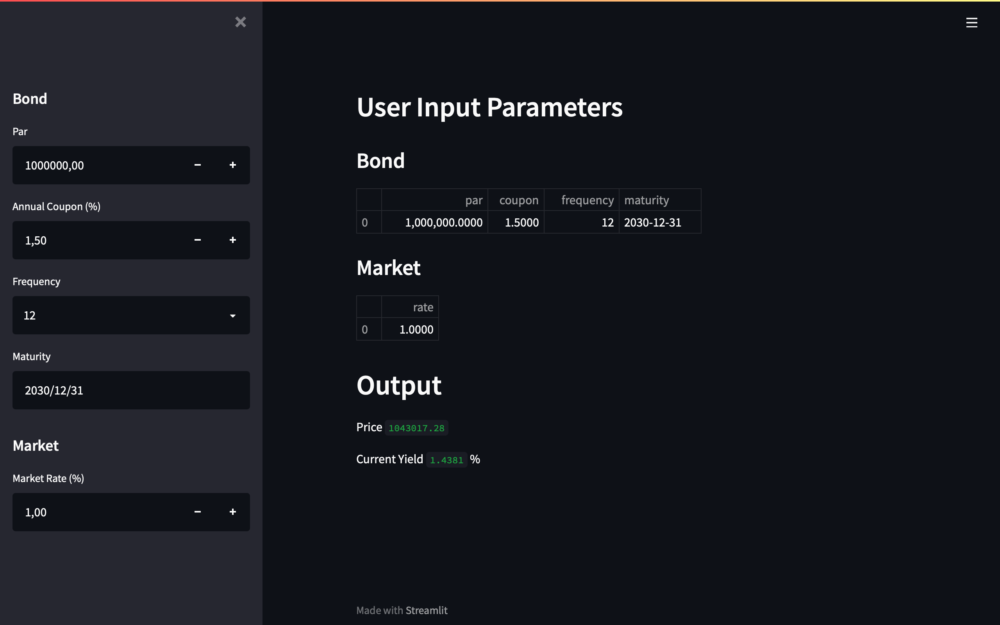

# Bond Valuation with Python

A bond valuation webapp in Python.

### Installation

Clone this repository :

	git clone https://github.com/romaincaraes/bond-valuation
	cd bond-valuation
	
You may want to use a virtual environment to keep a clean Python installation :

	python3 -m venv venv/
	source venv/bin/activate

Install the required dependencies :

	pip3 install -r requirements.txt
	
### Usage

To use the Bond Valuation web app, run the __app.py__ script : 

	streamlit run app.py

A new tab should open in your browser :

### Built With

- [Numpy](https://numpy.org/) - Fundamental package for scientific computing with Python,
- [Pandas](https://pandas.pydata.org/) - Library providing data structures and data analysis tools for Python,
- [Scipy](https://scipy.org/) - Software for mathematics, science, and engineering,
- [Streamlit](https://streamlit.io) - Open-source app framework,

### Dependencies

All the Python packages needed are listed in [requirements.txt](https://github.com/romaincaraes/bond-valuation/blob/master/requirements.txt) and on the [Dependency Graph page](https://github.com/romaincaraes/bond-valuation/network/dependencies).

### License

This project is licensed under the [MIT License](https://github.com/romaincaraes/bond-valuation/blob/master/LICENSE).

### Authors

- **Romain Caraës** - [romaincaraes](https://github.com/romaincaraes)
	- Email : [hello@romaincaraes.fr](mailto:hello@romaincaraes.fr)
	- Twitter : [@romaincaraes](https://twitter.com/romaincaraes)

See also the [GitHub Contributors page](https://github.com/romaincaraes/bond-valuation/graphs/contributors).
